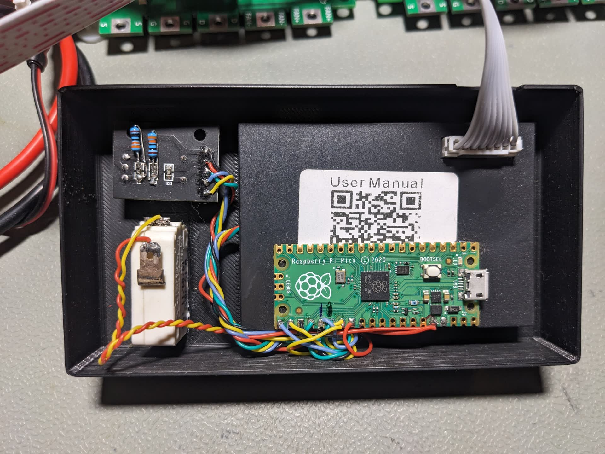
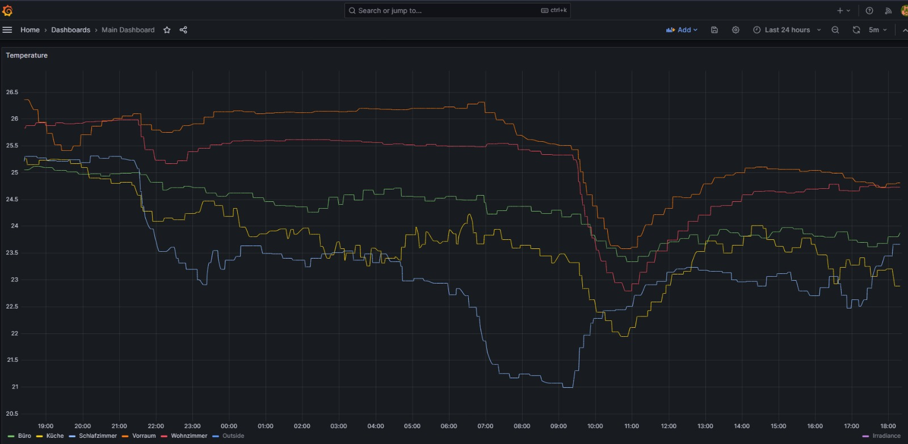
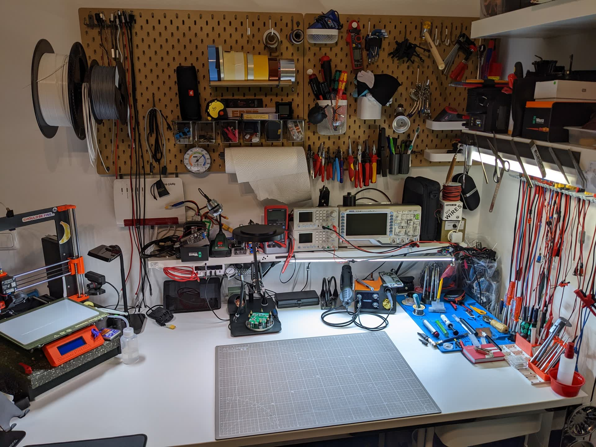
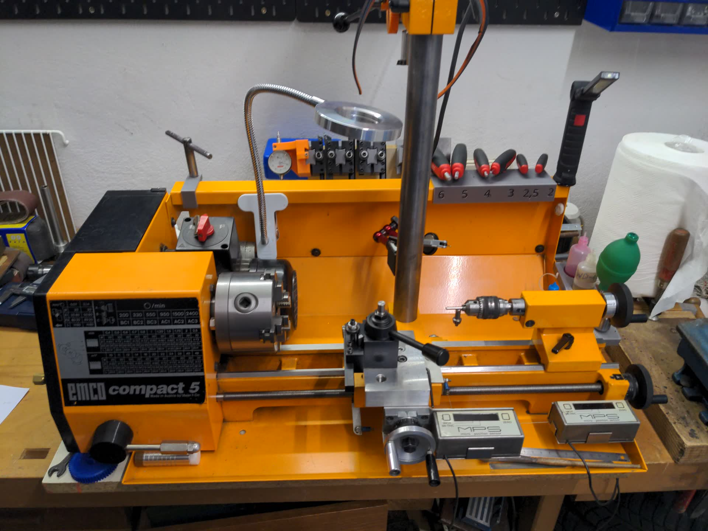

**Hey there! I'm Christoph and I love to tinker around - welcome to my portfolio! Within you'll find an overview of my embedded, hardware and software projects.**

*I do care deeply about everything I work on - that's why each project includes a brief description, goals, key technologies used, and links to repositories or pictures.*

*What I'm working on [right now](https://protofox.at/now/)*

## 🚀 Featured Project

### **Mobile Battery-supplied Lab Power Supply**
- **Description:** This supply can power anything up to 55 Volts and 6 Amps, while being completely mobile.  
It combines a 14s2p spot welded battery made of recycled 18650 cells, with an adjustable DC-DC converter in a 3D printed enclosure.  
In total the supply comes in under 2 kg and can deliver maximum power for about an hour (~300 Wh of energy).
- **Goals:** Backup-charge my e-scooter from 0-100 % SoC within 2 hrs
- **Technologies Used:**  Spot welding, 3D printing, DC-DC buck conversion, Soldering, CAD
- **Repository:** [Mobile-Battery-supplied-Lab-Power-Supply](https://github.com/OutFoxD/Mobile-Battery-supplied-Lab-Power-Supply)

## 🔋📟🤖🔌 Embedded Projects

### **Hacked electronic load**
- **Description:** Navigating this electronic load was a pain, so I added a Rotary encoder and split the whole thing into two parts.  
The power electronics lived under the table with the Interface and power connectors sitting above.  
Turns out it was not working as well as expected and got replaced anyways.
- **Goals:** Improved usability with separate UI board and a rotary encoder
- **Technologies Used:**  Raspberry Pi Pico, Rotary Encoder, 3D Printing, CAD, Soldering

### **Hacked humidifier with active control**
- **Description:** My girlfriend wanted her plants to grow better, so I made it happen.
- **Goals:** Operation withing optimal humidity range (60-80 %RH) to promote tropical plant growth
- **Technologies Used:**  Raspberry Pi Pico, OLED Display, 3D Printing, Temp and Humidity Sensing

 
### **Electroluminescence meaurements of PV panels**
- **Description:** Failure analysis of PV panels/systems was one of my topics at work and I continued the research privately as well.  
Turns out near-infrared imaging can be used, when feeding back power into PV panels to image faults and micro-cracks.
- **Goals:** Insights on ElectroLuminesence for PV panel failure analysis.  
Insights on optical systems and optical filtering.
- **Technologies Used:** Near-Infrared Imaging, Raspberry Pi Zero W, Raspberry Pi NoIR Cam, Modified CMOS Digicam

## 🛠️ Hardware Projects

### **Restoration and modification of Emco Unimat 3 Lathe**
- **Description:** I got this machine for cheap and deeply enjoy restoring and improving old, solidly built hardware. 
- **Goals:** Get the machine cleaned up and running.  
Improve it to be able to make parts reproducably within ±10 µm accuracy.  
Install digital readout on both axes and make the machine nice to work on in general.
- **Technologies Used:** 3D Printing, CAD, Conventional Turning, CNC Servo and Speed Control, Powder Coating, Woodworking, Scraping 
- **After:** 
- **Before:** 

### **Rejuvenating old Bosch battery packs**
- **Description:** My batteries could no longer provide enough power to supply my vacuum cleaner on turbo mode.  
So the cells had to go and got replaced by Molycel 28R cells held together by steel-copper sandwhich welds for improved internal resistance.
- **Goals:** Improved capacity and internal resistance of my Bosch batteries.  
Insights into spot welding and specifically steel-copper sandwhich welds.  
Preparation of used batteries for lower demand projects.
- **Technologies Used:**  Spot welding

## 💻 Software Projects

### **Temp and Humidity logging from Tado Thermostats**
- **Description:** Simple logging of hemperature and humidity was set up with the data from Tado radiator thermostats.  
I pull the data from the TadoAPI - a local way to get it was not in place, when I realized the project.  
After the data is gatered it's saved to an InfluxDB and later visualized in Grafana.  
Grafana also does the conversion from relative to absolute humidity.
- **Goals:** Gaining Insights how my flat heats up during summer and how and when washed clothes are fullie dried
- **Technologies Used:** Raspberry Pi 4, Docker, NodeRed, Grafana, InfluxDB, TadoAPI

## 📫 Contact & Links
- **Email:** cfuchsey@gmail.com
- **GitHub:** [github.com/OutFoxD](https://github.com/outfoxd)
- **Printables:** [printables.com/@OutFoxD/models](https://www.printables.com/@OutFoxD/models)
- **Thingiverse:** [thingiverse.com/outfoxd/designs](https://www.thingiverse.com/outfoxd/designs)
- **Linkedin**: [linkedin.com/in/christoph-fuchs](https://www.linkedin.com/in/christoph-fuchs-5b9b18214/)

## ✨ Where the magic happens
- In my home lab

- in the [Grand Garage](https://grandgarage.eu/) - my local makerspace
- or in my Dad's workshop 

